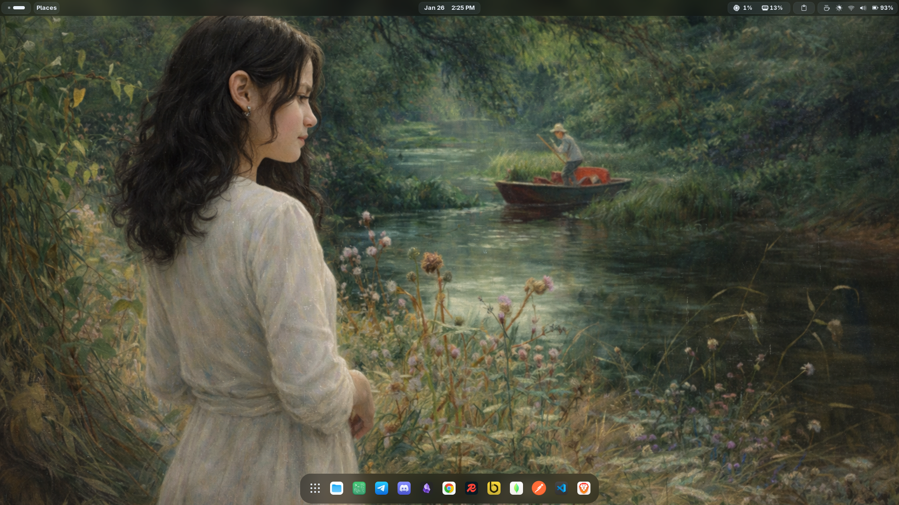
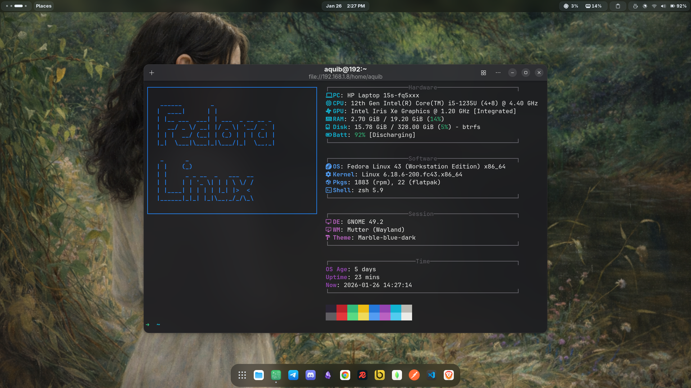
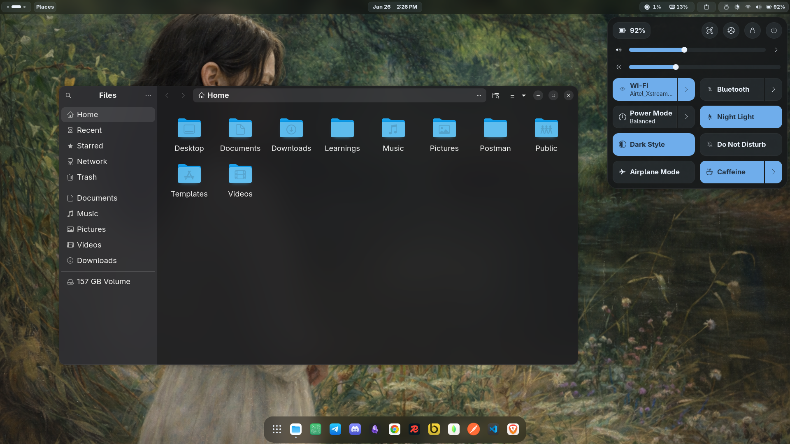

# Fedora GNOME Rice Guide

## *Look of the desktop*

## Configuration Status

### ✅ Done

- **Fastfetch** configuration completed
- **Icon Theme** configured  
  - WhiteSur Icon Theme  
  - Alternative icons (`-a`)
- **GNOME Shell Theme** configured  
  - Marble Shell Theme  
  - Filled – Blue variant

---

### ❌ Not Done

- **GNOME Extensions**
- **Extensions configuration**

---

*Other customization will be updated soon*